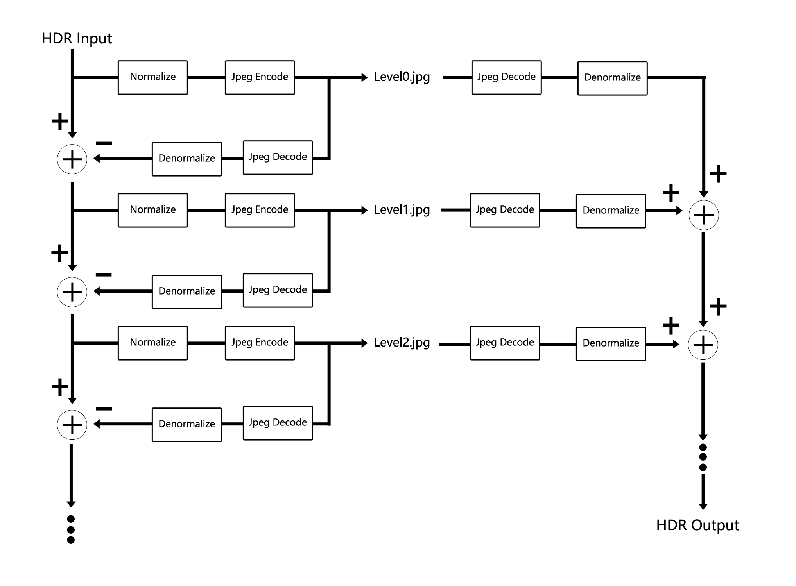

Fei Yang

Apr. 2023

Image compression is generally considered a solved problem. Over the decades, extensive effort has been put into this area in order to meet the increasing demand of efficient transfer and storage of images.

However, one small branch of image compression has been relatively overlooked, which is the compression of High Dynamic Range (HDR) images. Unlike normalized images which represent radiance values in as standardized, bounded SRGB color space, HDR images can easily exceed the boundary of the standard SRGB color by several times. Their higher dynamic range leads to higher demand of quantification digits per pixel. Although there are already a number of compression algorithms and storage formats proposed, such as Jpeg 2000, Jpeg XR, Jpeg XT, OpenXR etc., none of them gets wide support from medias and processing tools. There is also a special group, which includes block compression formats like BC6H and ASTC HDR. These formats are designed for saving runtime VRAM footprint rather than the storage and transfer footprint. Basically, a high-compression rate, widely supported HDR format is still very difficult to find. In practice, simple encoding schemes like RGBE or RGBM based ones are most often used.

In computer graphics, HDR assets are usually related to light baking. For realistic reproduction of a scene that contains complicated lighting, a 3D application usually needs to store pre-baked environment maps, probes and lightmaps, which may contain large amount of asset data. Among them, lightmaps are exclusively represented in HDR image form. Their dense nature plus the lack of an efficient storage format makes their size issue very frequently stand out.

During the development of the rendering engine [Three.V8](https://github.com/fynv/three.v8), we also hit this problem. Because of that the system is mobile & web targeting, transfer efficiency is among our top concerns. After testing several ideas, we found that a JPEG based solution performs surprisingly well. It is a cascaded encoding scheme that invokes the JPEG encoder and decoder several times during compression. To our best effort, we cannot find it in any existing literature, so we are sharing it here.

# Encoding

We first normalized the input image to its minimum/maximum ranges of its RGB channels. The normalized image is sent to a JPEG encoder, which produces Level0.jpg. 

We then decode and denormalize the JPEG data and subtract it from the HDR input, which gives us the residual of the 1st level. We normalize and encode the residual the same way as the input image, which produces Level1.jpg.

We do it iteratively up to 6 levels. The outputs are Level0.jpg ~ Level5.jpg.

We store the filename information and the minimum/maximum range values as a separate CSV file, which is necessary for decoding.

# Decoding 

The JPEG images from the first n levels are taken as input. They are simply decoded and denormalize and added together.

Because that JPEG decoders are widely available, and the decoding process is extremely simple, the format is compatible almost everywhere from desktop to mobile to web.

# Result 

We have not tested very widely yet. According to the data we have, using the output of the first 4 levels, satisfying result can be restored in most cases. The bit rate (number of bits of all 4 files added together divided by the number of pixels) is between 3bpp and 5bpp.

